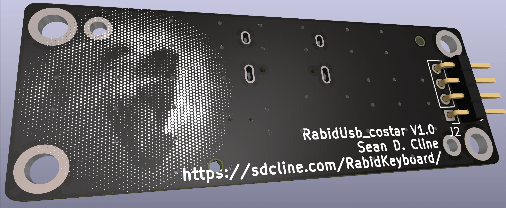

# RabidKeyboard

This project is an ode to the old-school Cooler Master [QuickFire Rapid](https://deskthority.net/wiki/Cooler_Master_QuickFire_Rapid) TKL keyboard -- a board that introduced many people to the mechanical keyboard hobby years ago.

Over time, upgrade parts for these old mechanical keyboards have become hard to find. This project attempts to solve that by providing PCB designs that can be manufactured by services like [JLCPCB](https://jlcpcb.com/) or [PCBWay](https://www.pcbway.com/).

With the PCBs in this repository, you could:
 - Build a TKL keyboard from scratch.
 - Replace the mini-USB plug with USB-C on your Cooler Master QFR.
 - Replace the PCB in your QFR (or compatible) with a custom design running the [KMK firmware](https://github.com/KMKfw/kmk_firmware).
 - Replace the plate in your TKL keyboard with one made of FR-4 and support for more stabilizers. (Stock Costar, Cherry Plate mount, or PCB mount when the PCB is also replaced.)

## PCB
The PCB is designed in [KiCad](https://www.kicad.org/) to be easily soldered by hand. At its heart is the [RP2040 Stamp](https://www.lectronz.com/products/rp2040-stamp), which fits nicely beside the arrow keys.

## Plate
The plate is just a PCB without any copper traces. When sending it for manufacture, you can select the thickness of FR-4 to get the level of flex you like.

It's generated by copying the User.1 layer out of the PCB design and changing the layer to Edge.Cuts. The keyswitch footprints use the User.1 layer for the plate cutout which makes sure the plate cutouts always line up with the key switch location on the PCB.

> Note: This abuses the routing capabilities of a PCB manufacturer, so they'll likely charge extra for their trouble.

## Costar USB-C Daughterboard
This PCB replaces the original mini-USB daughterboard in the Cooler Master QFR. Mounting holes match the [original PCB](reference/Quickfire%20Rapid/USB%20Daughterboard%20-%20Front.jpg) so it's a drop-in replacement. A little bit of filing is required to widen the mini-USB hole the width of the USB-C port.

## YMDK USB-C Daugterboard
Just like the Cooler Master QFR, Filco Majestouch 2, and KBParadise V80, the RabidKeyboard PCB in this repo fits into the YMDK F87 aluminum case.
[[Amazon]](https://amzn.com/dp/B06XNTWXWL)
[[AliExpress]](https://www.aliexpress.us/item/2251832431251957.html)
[[Ymdkey]](https://ymdkey.com/products/f87-tkl-cnc-anodized-aluminum-case-for-filco-cm-cooler-master-87-tenkeyless)

Unfortunately, the USB daughterboard that [comes with](reference/YMDK/YMDK%20Usb%20-%20Back.png) the YMDK F87 case lacks the [required 5.1k resistors](https://hackaday.com/2023/01/04/all-about-usb-c-resistors-and-emarkers/). It works fine when plugged in using a USB-C to Type-A cable, but does not function when plugged in using a USB-C to USB-C cable. It also lacks protection circuitry. The design in this repository is a drop in replacement with some improvements:
 - 5.1k CC1 and CC2 sense resistors to work with USB-C cables.
 - [TVS diodes](https://en.wikipedia.org/wiki/Surge_protector#Transient_voltage_suppressor) to keep static shocks from reaching the microcontroller.
 - 500mA polyfuse to protect from short circuits.
 - Reverse polarity protection diode.
 - Ferrite beads to reduce high frequency EMI.

